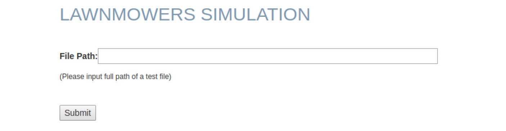

# Lawnmower Simulation Web App

## Description
Built a web app with Java for users to run lawnmower simulation and monitor its progress. Designed and implemented RESTful APIs with Java Spring Boot framework. Developed a search algorithm to improve lawn cutting efficiency by 80%. Designed an interactive and responsive UIs with React.js framework.

## How TO Play
1. Type into the terminal: ./mvnw spring boot:r un
2. Open a browser and input the address: http://127.0.0.1:8080/
3. Input the file path of a test case and click submit

4. A sample of the initial scenario according to the test case file:

5. Click on the buttons to test the application
6. After finishing a test case, refresh the page to load other test cases

## Class Diagram

## Deployment Diagram

## Sequence Diagram

## Use Case Diagram

